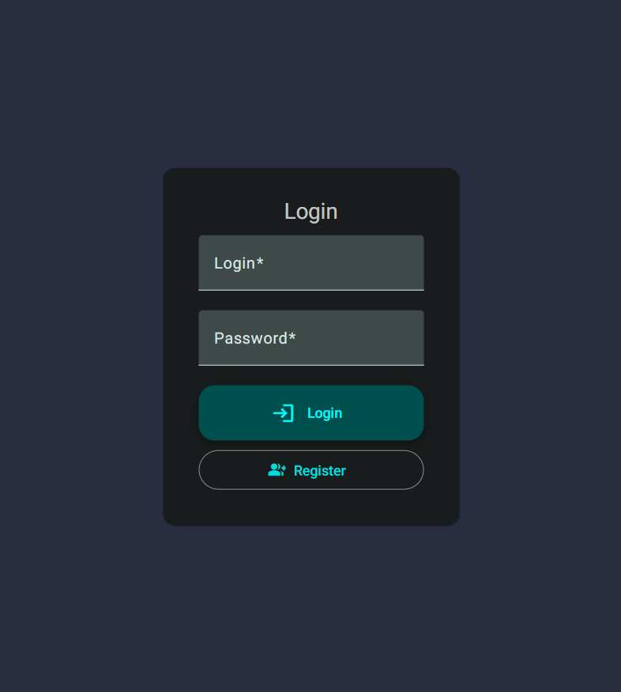
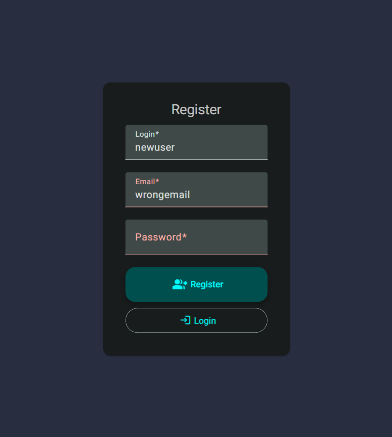
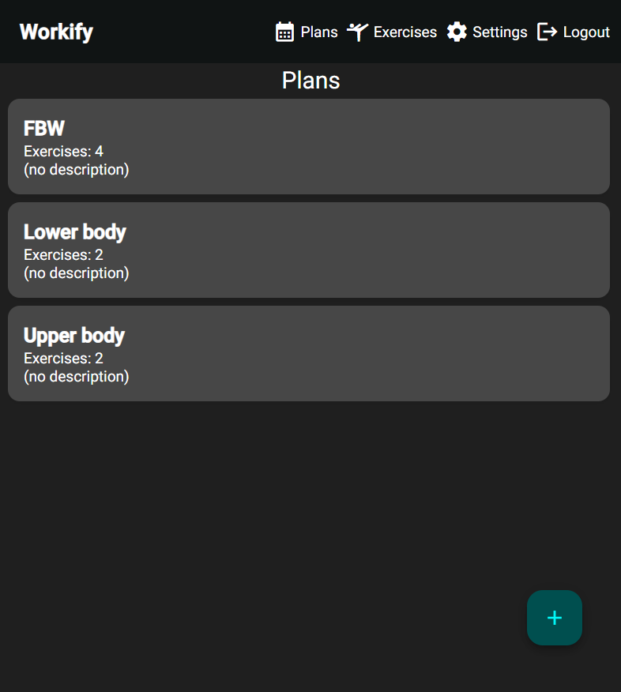
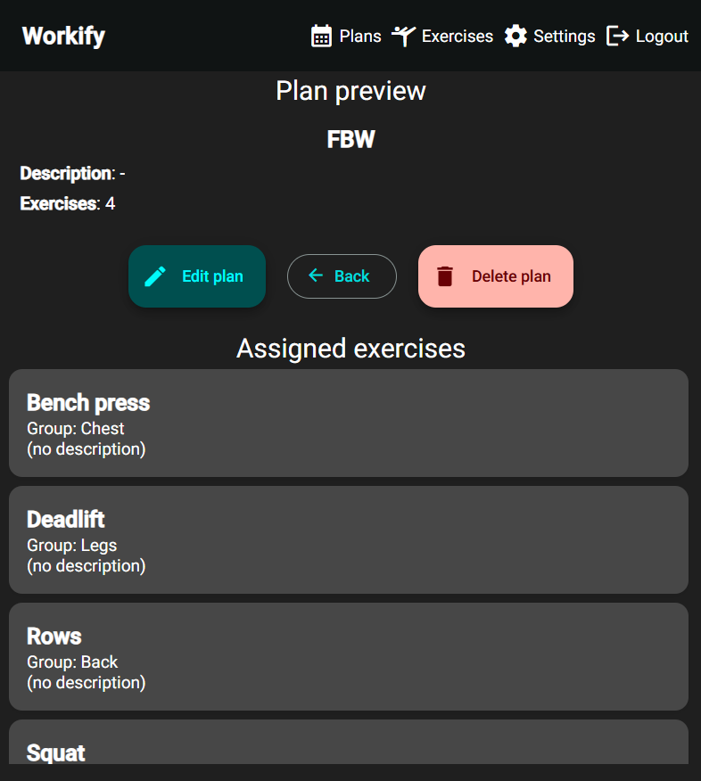
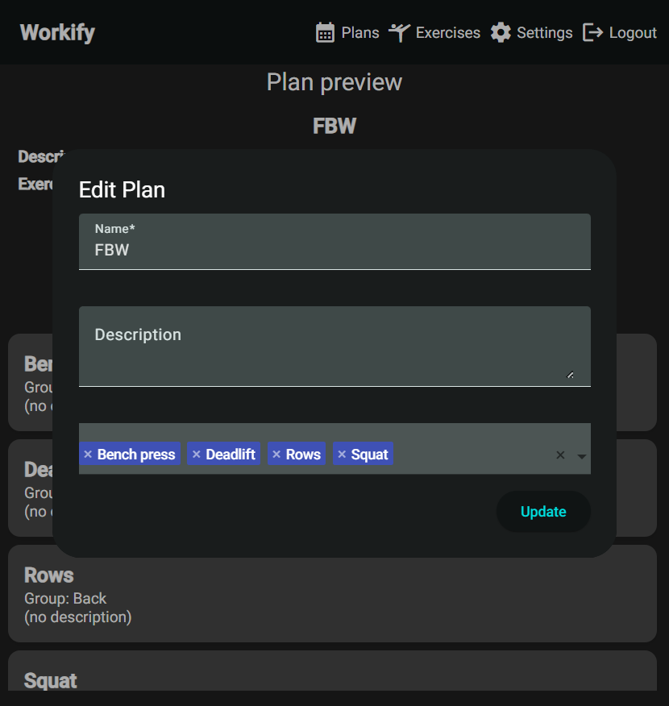
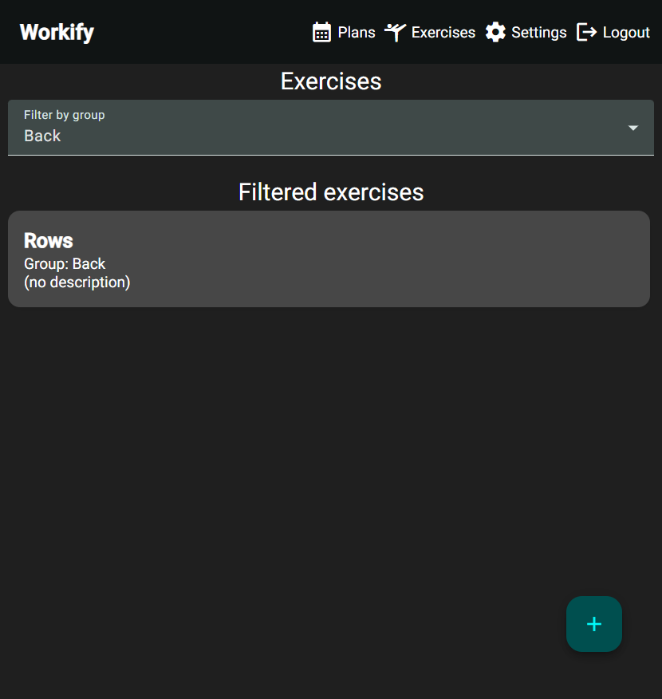
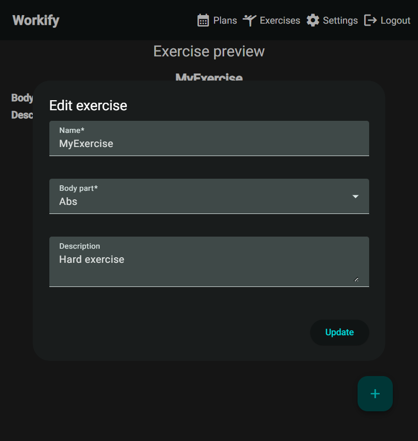
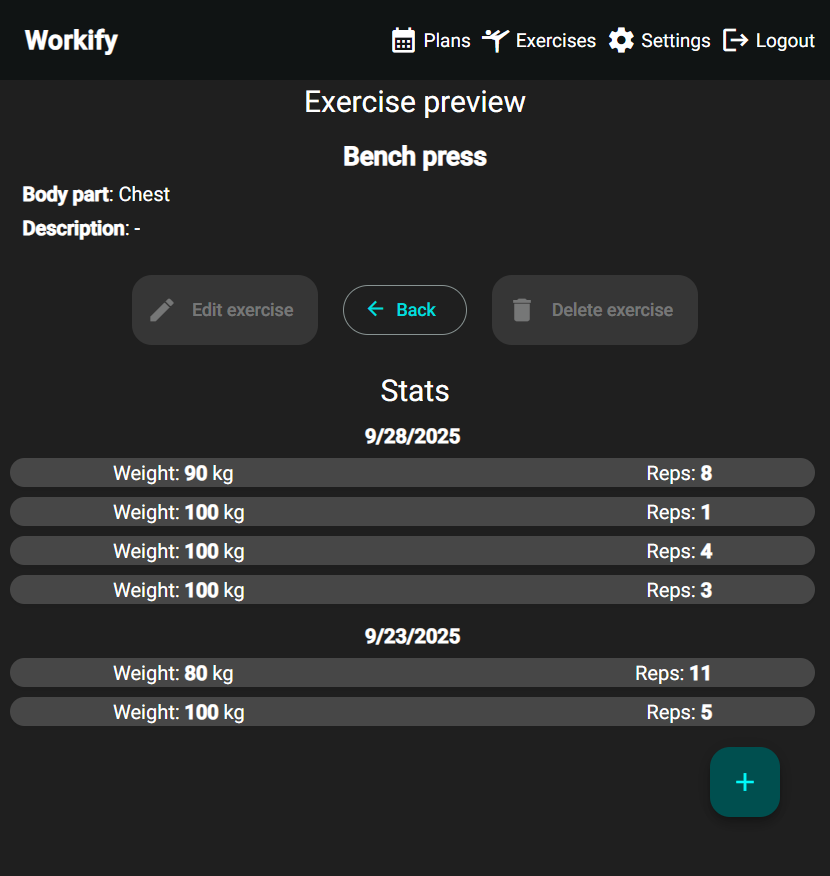
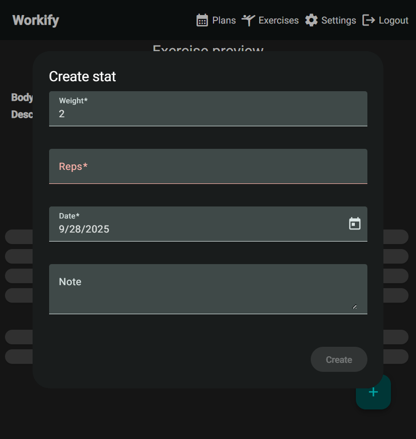

# WorkifyApp

A modern **workout tracking application** consisting of:
- **Frontend (Angular 20)**: A responsive web app for managing workouts, tracking progress, and visualizing exercise stats.  
- **Backend (.NET 9 Microservices)**: An event-driven system handling authentication, workouts, and exercise statistics.

## 📖 Table of Contents
- [Backend](#workout-microservices-backend)
- [Frontend](#workifyapp-frontend)
- [Screenshots](#screenshots)

---

# Workout Microservices Backend

A modern, event-driven microservices backend for a workout tracking application built with **.NET 9**, using **Entity Framework Core**, **MassTransit**, **RabbitMQ**, **PostgreSQL**, **Serilog** and **Docker Compose**.

---

## 🧩 Microservices Overview

This system is split into 3 independent, containerized microservices:

### 1. **Auth Service**

* Handles user registration, login, and user deletion
* Uses **JWT** for authentication

### 2. **Workout Service**

* Manages workout plans and exercises
* Shares exercise definitions and user plans

### 3. **ExerciseStat Service**

* Stores and provides statistics for exercises

All services communicate asynchronously via **MassTransit** using **RabbitMQ**.

---

## 🛠️ Technologies Used

* **.NET 9**
* **MassTransit**
* **RabbitMQ**
* **Entity Framework Core**
* **PostgreSQL**
* **JWT**
* **Docker & Docker Compose**
* **xUnit & Moq**

---

## 🚀 Getting Started

To run the entire system locally:

```bash
docker compose -f 'dev-docker-compose.yml' up --build 
```

## 🧪 Testing

Unit tests are written using **xUnit** and **Moq**.
Each service has its own test project under `/tests`.

Run tests with:

```bash
dotnet test
```

---

## 📡 Communication Flow

All services publish and subscribe to domain events via RabbitMQ.
For example:

* `UserDeleted` published by Auth service
* Subscribed by ExerciseStat and Workout services to clean up unnecessary user data

---

## 📊 Logging & Observability

Logging across all services is handled using Serilog, a structured logging library that integrates seamlessly with the .NET ecosystem.
Logs are written to the console and forwarded to Seq

---

# WorkifyApp Frontend

The frontend is built with **Angular 20** and provides a modern, responsive user interface for the workout tracking application.

---

## ✨ Features
- User authentication (login, signup, JWT-based session handling)
- Workout and exercise plan management
- Real-time updates and data synchronization with backend services
- Visualization of exercise statistics
- Responsive UI with **Angular Material**

---

## 🛠️ Technologies Used
- **Angular 20**
- **TypeScript**
- **RxJS**
- **Angular Material**
- **Jest** for unit testing
- **Docker** for containerized deployments

---

## 🚀 Running the Frontend

Navigate into the frontend project folder:

```bash
cd Frontend/WorkifyApp
npm install
npm start
```

---

## Screenshots










